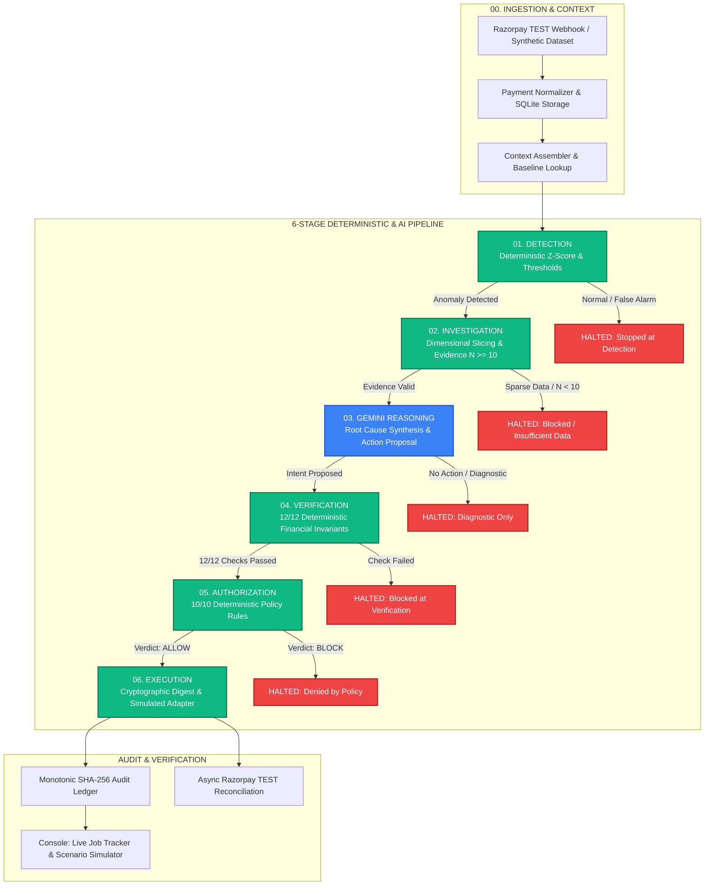
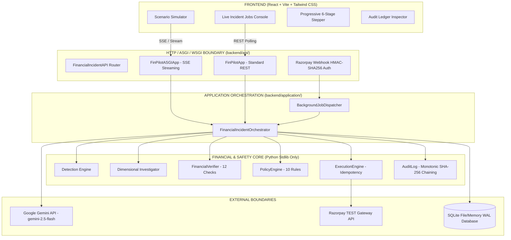

# Merchant FinPilot

**Autonomous Financial Incident Intelligence & Deterministic Remediation for Modern Payment Gateways**

[](backend/tests)
[](backend/tests/razorpay)
[](frontend/tests)
[-blue)](frontend)
[](#security--safety)
[](#validation--release-status)

Merchant FinPilot is an AI-native financial incident response platform designed for digital merchants processing payments at scale. It continuously detects statistical payment anomalies against historical baselines, investigates root causes using dimensional breakdown slicing, formulates remediation intents via Google Gemini, and enforces **strict deterministic mathematical verification and policy authorization before any simulated execution can occur**.

---

## Overview

High-throughput payment stacks experience transient failures across acquirers, bank gateways, regional networks, and specific payment methods. When an issue escalates into a genuine payment incident, merchants face a critical dilemma: manual investigation takes 20–45 minutes while customers drop off, but naive LLM-driven automation risks catastrophic financial hallucination, incorrect refunds, or uncontrolled customer communications.

**Merchant FinPilot solves this through a fundamental architectural separation of concerns:**
- **AI (Google Gemini)** is utilized exclusively for **unstructured reasoning, root cause synthesis, and proposing actions**.
- **Deterministic Systems** strictly enforce **mathematical invariant verification, policy authorization, idempotency, and execution boundaries**.

The LLM is **never** given direct API credentials to execute financial actions, mutate account balances, or trigger customer-facing side-effects.

---

## The Problem

1. **Payment Failures $\neq$ Incidents**: A payment failure is a normal occurrence in modern payment rails. An incident occurs when failure rates deviate with statistical significance ($\ge 3\sigma$ z-score) from a comparable historical baseline (same hour of day, day of week).
2. **Raw Failure Counts Are Insufficient**: Observing 50 failures means nothing without context. Is overall traffic up 500%? Did a single issuing bank go down? Is an invalid card payload circulating? Remediation requires multi-dimensional dimensional slicing (payment method, bank, issuer, error code, region).
3. **Remediation Demands Empirical Evidence**: Remediating without sufficient transaction volume ($N < 10$) is statistical speculation. Autonomous agents must refuse to act on sparse or noisy data.
4. **Autonomous Financial Actions Require Hard Gates**: In fintech, an LLM must never be a single point of failure. Actions such as creating recovery payment links or notifying merchants must pass pure boolean invariant checks before execution.

---

## The Solution

Merchant FinPilot operates a **6-Stage Autonomous Incident Pipeline** that enforces strict boundary transitions:



---

## Six-Stage Pipeline

| Stage | Name | Authority Type | Typical Duration | Purpose & Transition Rule |
| :--- | :--- | :---: | :---: | :--- |
| **01** | **DETECTION** | Deterministic | ~0.07 ms | Evaluates rolling transaction windows against historical baselines. Halts if deviation is below threshold ($z < 3.0$ or false alarm). |
| **02** | **INVESTIGATION** | Deterministic | ~70.0 ms | Performs dimensional slicing across rails, error codes, banks, and regions. Enforces the strict $N \ge 10$ transaction evidence gate. |
| **03** | **REASON (Gemini)** | AI / Probabilistic | 2,000–4,000 ms | Dispatches normalized evidence to Google Gemini. Synthesizes root cause and formulates an unexecuted `AgentIntent`. Halts if evidence is inconclusive. |
| **04** | **VERIFY** | Deterministic | ~0.84 ms | **Hard Safety Gate**: Mathematically checks 12 boolean financial invariants. Halts if any invariant fails. |
| **05** | **AUTHORIZE** | Deterministic | ~0.08 ms | **Policy Boundary**: Evaluates 10 deterministic governance rules (velocity, blast radius, action whitelists). Halts if verdict is `BLOCK`. |
| **06** | **EXECUTE** | Deterministic | ~0.09 ms | Computes SHA-256 idempotency digest and dispatches to `SimulatedExecutionAdapter` or Razorpay TEST API. Zero real-money mutation. |

### Stage 3: The Role of Google Gemini
Gemini functions as an **investigative analyst**, not an autonomous financial actor:
- It receives clean, structured diagnostic evidence (anomalous failure rates, dimensional concentrations, baseline distributions).
- It generates diagnostic rationales, selects appropriate remediation actions (e.g., `CREATE_PAYMENT_LINK`, `NOTIFY_MERCHANT`, `NO_ACTION`), and binds references to verified evidence items.
- It outputs a strongly-typed schema (`AgentResponse`).
- **Gemini possesses zero execution authority**: its proposal is treated as an unverified, untrusted claim until evaluated by Stage 4.

### Stages 4 & 5: The Deterministic Safety Boundary
- **FinancialVerifier (12 Checks)**: Validates that claimed amounts match raw database records exactly, error codes correlate with proposed remediation, targets exist in the incident evidence set, and baseline lookbacks satisfy statistical significance.
- **PolicyEngine (10 Rules)**: Enforces business blast radius limits (maximum recovery link value $\le ₹50,000$), rate limits per merchant, allowed action whitelists, and idempotency guarantees.

---

## Fail-Closed Safety Model

Merchant FinPilot is engineered from first principles to be **strictly fail-closed**:

1. **Evidence Floor Gate ($N \ge 10$)**: If an incident cluster contains fewer than 10 transactions in the evaluation window, `has_sufficient_evidence` is set to `False`. The pipeline halts at Stage 2 or Stage 3 with `BLOCKED: Insufficient data`, preventing speculative actions on statistically insignificant volume.
2. **No Hallucinated Intent Execution**: If Gemini fails to propose an action, times out, or produces malformed output, the orchestrator halts immediately. No default or fallback execution occurs.
3. **Invariant Rejection**: If even 1 of the 12 deterministic checks fails, the entire proposed intent is discarded. Downstream stages (Policy and Execution) **never execute**.
4. **Hard-Coded Live Credential Blocking**: `RazorpayExecutionAdapter` checks `key_id.startswith("rzp_test_")`. Any key starting with `rzp_live_` raises `LIVE_MODE_FORBIDDEN` and halts immediately before any HTTP socket connection can be opened.
5. **Idempotency & Replay Protection**: Every execution computes a deterministic SHA-256 digest of `(merchant_id, action, target_id, parameters)`. Duplicate triggers return `SKIPPED_DUPLICATE` with identical reference digests.

---

## Architecture

Merchant FinPilot follows a layered, dependency-isolated architecture. The domain core (`backend/domain/`) and mathematical engine (`backend/financial/`) rely **only on the Python Standard Library**.



---

## Live Incident Flow

Merchant FinPilot provides full real-time integration with Razorpay TEST webhooks:

```
Signed Razorpay TEST Webhook (payment.failed)
  ↓
1. HMAC-SHA256 Signature Verification (Constant-Time Compare)
  ↓
2. SQLite Persistence & Queueing (Status: QUEUED)
  ↓
3. Background Worker Pickup (Status: PROCESSING)
  ↓
4. Historical Baseline Lookup (7-day lookback, 21,900 reference points)
  ↓
5. Anomaly Detection & Incident Aggregation
  ↓
6. Deterministic Dimensional Slicing & Evidence Compilation
  ↓
7. Gemini Agent Reasoning & Intent Formulation
  ↓
8. Deterministic Financial Invariant Verification (12 Checks)
  ↓
9. Policy Engine Evaluation (10 Rules -> ALLOW)
  ↓
10. Execution Adapter Dispatch (Simulation / Razorpay TEST Reference)
  ↓
11. Audit Record Generation & Terminal Update (Status: COMPLETED)
```

### Transport & Progress Mechanics
- **Scenario Simulator**: Connects via **Server-Sent Events (SSE)** (`POST /api/v1/incidents/stream`). Discrete stage transitions are pushed over the open connection, paced at 120ms intervals in the frontend compositor so each stage transition is perceptible.
- **Live Incident Jobs**: Monitored via standard REST polling (`GET /api/v1/incidents/jobs`). Background workers write real progress (`current_stage`, `stage_status`) to SQLite. Stages 4, 5, and 6 execute in $\sim 1.01 \text{ ms}$ total, transitioning directly into the completed terminal result.

---

## Frontend Architecture

The frontend is a TypeScript SPA built with React 18 and Tailwind CSS:

1. **Scenario Simulator**:
   - Allows instant execution of 11 pre-computed synthetic incident scenarios (e.g., `upi_failure_spike`, `card_failure_spike`, `provider_failure`, `false_alarm`, `insufficient_data`).
   - Streams live progress via SSE.
   - Visually renders the exact pipeline path, including fail-closed halts (`BLOCKED` or `STOPPED`).
2. **Live Incident Job Tracker**:
   - Monitors live webhook triggers received from the payment gateway.
   - Displays real-time statuses (`QUEUED`, `PROCESSING`, `COMPLETED`, `FAILED`).
   - **Stale-Response & Race Protection**: Synchronized through `selectedJobIdRef`. Switching between jobs immediately invalidates stale responses; late-arriving responses for prior jobs are safely discarded.
3. **Hard Safety & Stage Cards**:
   - **Investigation Card**: Displays dimensional concentrations and evidence counts.
   - **Gemini Agent Card**: Details root-cause synthesis, verified facts, and proposed action.
   - **Verification Card**: Highlights the dominant 12/12 invariant verdict.
   - **Policy Decision Card**: Confirms rule evaluation, velocity bounds, and authorization status.
   - **Execution Result Card**: Emphasizes simulation isolation, displaying provider references (`plink_...`) and SHA-256 execution digests.

---

## Technology Stack

| Layer | Technologies |
| :--- | :--- |
| **Frontend** | React 18, TypeScript 5.4, Vite 5.3, Tailwind CSS 3.4, Lucide React |
| **Backend & API** | Python 3.9+, Pure Stdlib WSGI/ASGI, FastAPI / Uvicorn (optional boundary) |
| **AI / Reasoning** | Google Gemini API (`gemini-2.5-flash`, `gemini-3.1-flash-lite-preview`) |
| **Database** | SQLite3 with Write-Ahead Logging (`WAL`), `synchronous=NORMAL`, in-memory fallback |
| **Payment Gateway** | Razorpay TEST API, HMAC-SHA256 Webhook Verification |
| **Testing** | Python standard `unittest`, Node.js ESM Test Runner, Vite Production Build |
| **Deployment** | Render (Dockerized / Python Web Service) |

---

## API Endpoints

| Method | Path | Description | Request / Response Behavior |
| :--- | :--- | :--- | :--- |
| `GET` | `/health` | Application Health & Mode | Returns service status, version, and execution mode (`simulated` vs `razorpay_test`). |
| `GET` | `/api/v1/scenarios` | List Scenarios | Returns metadata for all 11 supported synthetic scenarios. |
| `POST` | `/api/v1/incidents/process` | Synchronous Processing | Executes full 6-stage pipeline for a scenario or merchant ID. Returns complete `PipelineResult`. |
| `POST` | `/api/v1/incidents/stream` | Server-Sent Events Stream | Streams real-time `StageProgressEvent` objects followed by the terminal pipeline response. |
| `GET` | `/api/v1/incidents/jobs` | List Webhook Jobs | Returns recent background incident jobs. Supports `status`, `merchant_id`, and `limit` query parameters. |
| `GET` | `/api/v1/incidents/jobs/{job_id}` | Get Webhook Job | Returns full execution state, current stage, and terminal payload for a specific job. |
| `GET` | `/api/v1/incidents/{incident_id}` | Get Incident Record | Retrieves stored incident details and compiled evidence. |
| `GET` | `/api/v1/audit` | Audit Trail Ledger | Returns tamper-evident audit events with SHA-256 payload digests. |
| `POST` | `/api/v1/webhooks/razorpay` | Ingest Webhook | Authenticates Razorpay webhook via HMAC-SHA256 signature and enqueues background processing. |

---

## Testing & Verification

The codebase maintains 100% automated test coverage across all domains, safety gates, and integration boundaries:

```bash
# 1. Complete Backend Test Suite (703 tests)
python3 -m unittest discover -t . -s backend/tests

# 2. Razorpay Integration & Safety Suite (70 tests)
python3 -m unittest discover -t . -s backend/tests/razorpay

# 3. Frontend Incident Console & Invariant Suite (17 tests)
node frontend/tests/incident_jobs.test.mjs

# 4. Frontend Production Build Validation
npm run build --prefix frontend
```

### Verified Test Results
- **Backend Full Suite**: **703 / 703 passed** (0 errors, 0 failures, 144.7s)
- **Razorpay Integration**: **70 / 70 passed** (0 errors, 0 failures, 1.85s)
- **Frontend Console Tests**: **17 / 17 passed** (0 errors, 0 failures)
- **Frontend Build**: **1,482 modules transformed**, built cleanly in 799ms

---

## Security & Safety

- **Zero Hardcoded Secrets**: All API credentials and webhook secrets are loaded strictly from environment variables.
- **HMAC-SHA256 Verification**: Incoming webhooks are verified using constant-time comparison (`hmac.compare_digest`). Unsigned or forged payloads fail with HTTP 401 before touching application logic.
- **Test-Key Enforcement**: `RazorpayExecutionAdapter` inspects `key_id.startswith("rzp_test_")`. Live credentials (`rzp_live_*`) trigger `LIVE_MODE_FORBIDDEN` and halt immediately.
- **Integer Minor Units**: All financial arithmetic is performed in integer minor units (paise) using `Money(minor_units, Currency.INR)` to eliminate IEEE-754 floating-point inaccuracies.
- **Audit Integrity**: The `AuditLog` records append-only events with monotonically incrementing sequences and cryptographic SHA-256 payload digests.

---

## Project Structure

```
Merchant_FinPilot/
├── backend/
│   ├── agent/                 # Gemini LLM provider, prompt engineering, contracts
│   ├── api/                   # WSGI/ASGI application, routing, request contracts
│   ├── application/           # Pipeline orchestrator, background trigger dispatcher
│   ├── audit/                 # Append-only audit store with SHA-256 integrity
│   ├── data/                  # 11 canonical scenarios, dataset generators, ground truth
│   ├── db/                    # SQLite database adapter with WAL pragma optimizations
│   ├── detection/             # Multi-window metric evaluation, z-score anomaly detection
│   ├── domain/                # Pure standard library contracts (Money, Incident, Intent)
│   ├── execution/             # ExecutionEngine, idempotency store, simulated adapter
│   ├── financial/             # Historical baseline calculation, dimensional breakdown
│   ├── investigation/         # Dimensional anomaly slicing, evidence compilation
│   ├── policy/                # PolicyEngine, blast-radius rules, rate limiting
│   ├── razorpay/              # Client, adapter, HMAC webhook handler, reconciliation
│   ├── verification/          # FinancialVerifier enforcing 12 deterministic invariant gates
│   └── server.py              # Application startup factory and entry point
├── frontend/
│   ├── src/
│   │   ├── api/               # Typed REST and SSE streaming API client
│   │   ├── components/
│   │   │   ├── common/        # StageStepper, SimulationBanner, StatusBadges
│   │   │   └── dashboard/     # Hero, 5 Stage Cards, Job Tracker, Audit Modal
│   │   ├── App.tsx            # State synchronization, race guards, auto-polling
│   │   └── types.ts           # Full TypeScript domain contracts
│   ├── tests/                 # Incident jobs console test suite
│   └── package.json           # Frontend dependencies and build scripts
├── scripts/
│   └── seed_live_baseline.py  # Historical baseline seeder and live webhook runner
├── requirements.txt           # Optional boundary dependencies (FastAPI, Razorpay SDK)
└── .env.example               # Configuration template
```

---

## Getting Started

### Prerequisites
- Python 3.9 or higher
- Node.js 18 or higher & npm

### 1. Backend Setup
```bash
# Clone the repository
git clone https://github.com/vikramaditya7z/Merchant_FinPilot.git
cd Merchant_FinPilot

# Copy configuration template
cp .env.example .env

# Run backend in Offline Mock Mode (default, zero external API keys needed)
python3 backend/server.py
```
*The backend starts at `http://127.0.0.1:8000`.*

### 2. Frontend Setup
```bash
# In a separate terminal
cd frontend
npm install
npm run dev
```
*The frontend dashboard starts at `http://127.0.0.1:5173`.*

### 3. Optional: Running with Real Google Gemini
To enable live Gemini reasoning, configure `.env`:
```bash
FINPILOT_MODE=real
GEMINI_API_KEY=your_google_gemini_api_key
GEMINI_MODEL=gemini-2.5-flash
```
*Note: Real Gemini mode provides live LLM investigative synthesis, but execution remains strictly simulation/test-only.*

---

## Live Razorpay TEST Flow

To run an end-to-end test against Razorpay's TEST gateway using safe credentials:

```bash
# Run the automated live test verification script
PYTHONPATH=. python3 backend/tests/razorpay/verify_live_razorpay_test_flow.py
```
**Output Verified**:
```
[1] Loaded Razorpay Configuration: Key ID: rzp_test_... (Configured: True)
[2] Testing Razorpay TEST API Read Connectivity: GET /v1/payments succeeded.
[3] Executing Outbound Payment Link on Razorpay TEST API: Created plink_...
[4] Delivering Simulated Razorpay Webhook: Status 200 (Reconciliation matched)
[5] Verified Reconciled Execution State: Status succeeded
[6] Verified Audit Trail: 4 events, hash-chain integrity verified
>>> ALL RAZORPAY TEST LIVE END-TO-END CHECKS PASSED! <<<
```

---

## Evaluator Demo Flow

To quickly evaluate Merchant FinPilot in under 3 minutes:

1. **Open Dashboard**: Navigate to `http://localhost:5173` (or the deployed Render instance).
2. **Select Scenario**: Choose **`upi_failure_spike`** from the Scenario Runner.
3. **Execute Pipeline**: Click **"Run Incident Pipeline"**.
4. **Observe Detection (Stage 1)**: Note the baseline z-score ($z > 3.0$) triggering an incident.
5. **Observe Investigation (Stage 2)**: View dimensional concentration isolating UPI gateway failures.
6. **Observe Gemini Reasoning (Stage 3)**: Review live Gemini investigative findings and proposed `CREATE_PAYMENT_LINK` intent.
7. **Observe Verification (Stage 4)**: Verify that **12/12 deterministic checks** pass.
8. **Observe Authorization (Stage 5)**: Confirm PolicyEngine issues an **`ALLOW`** verdict.
9. **Observe Execution (Stage 6)**: Inspect the simulated execution result, provider reference, and SHA-256 digest.
10. **Test Fail-Closed**: Select **`insufficient_data`** or **`false_alarm`**; observe that the pipeline cleanly stops at Detection or blocks at Investigation, executing zero downstream actions.

---

## Design Principles

1. **AI Proposes, Deterministic Systems Verify**: LLMs reason over messy telemetry, but hard mathematical code enforces truth.
2. **Fail-Closed by Default**: If data is sparse, confidence is low, or any check fails, the pipeline halts immediately.
3. **Evidence Before Action**: No remediation intent is accepted without an empirical transaction evidence set ($N \ge 10$).
4. **Policy Before Execution**: Invariants, rate limits, and blast-radius rules must authorize every action before execution dispatch.
5. **Simulation Isolation**: Production money paths are physically prevented in test and simulation configurations.
6. **Idempotent by Design**: Every execution generates a cryptographic hash key ensuring duplicate actions are skipped.
7. **Complete Auditability**: If an action is not recorded in the monotonic cryptographic audit log, it did not happen.

---

## Validation & Release Status

Merchant FinPilot is **release-ready for the current competition and demonstration scope**:
- **703 / 703** Backend Tests Passing
- **70 / 70** Razorpay Integration Tests Passing
- **17 / 17** Frontend Console Tests Passing
- Clean TypeScript production build (0 warnings, 0 errors)
- Fully verified deployed Render backend with file-backed persistent SQLite WAL storage
- Frozen release commit: `b7af64b`

---

## Future Improvements

- **Multi-Gateway Federation**: Extend adapter layer to aggregate baseline telemetry across PayU, Cashfree, and Stripe simultaneously.
- **Automated Acquirer Routing**: Translate verified gateway degradation directly into dynamic routing weight adjustments.
- **Predictive Pre-Outage Dampening**: Utilize time-series forecasting to alert merchants prior to breach of statistical failure thresholds.

---

## Credits

Developed for the **Merchant FinPilot** initiative — Autonomous, deterministic financial incident intelligence for modern payment operations.
